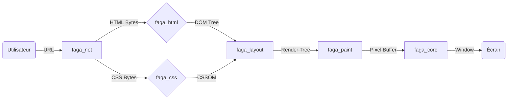

<div align="center">
  <h1>FAGA Browser</h1>

  <p>
    <strong>Free. Anonymous. Guarded. Access.</strong><br>
    Le navigateur web souverain, forgé entièrement en Rust.
  </p>

  <p>
    <a href="https://github.com/Infuseting/FAGA/actions"></a>
    <a href="https://crates.io/"></a>
    <a href="LICENSE"></a>
    <a href="#"></a>
    <a href="#"></a>
  </p>

  <h4>
    <a href="#-à-propos">À propos</a> •
    <a href="#-fonctionnalités-clés">Fonctionnalités</a> •
    <a href="#-installation">Installation</a> •
    <a href="#-architecture">Architecture</a> •
    <a href="#-roadmap">Roadmap</a>
  </h4>
</div>

<br>

---

## 📖 À propos

**FAGA** (Free Anonymous Guarded Access) est un projet d'ingénierie système visant à recréer un navigateur web moderne "from scratch", sans utiliser les moteurs existants (Chromium, Gecko, WebKit).

Écrit entièrement en **Rust**, FAGA vise à prouver qu'il est possible de naviguer sur le web moderne avec une empreinte mémoire minimale, tout en garantissant une confidentialité absolue par défaut. Son architecture modulaire permet de basculer entre une interface utilisateur futuriste et un mode "héritage" optimisé pour les ressources limitées.

> ⚠️ **État du projet :** Alpha / Expérimental. Ce logiciel est en développement actif et n'est pas encore recommandé pour une utilisation quotidienne critique.

---

## ⚡ Fonctionnalités Clés

### 🛡️ Privacy by Design (Confidentialité)
* **Isolation Totale (State Partitioning) :** Chaque site web possède son propre conteneur de données. Les cookies tiers sont techniquement impossibles à croiser.
* **Anti-Fingerprinting Actif :** FAGA injecte du bruit mathématique dans les canvas HTML5 et normalise les APIs système pour rendre votre empreinte numérique indiscernable de la masse.
* **Network Shield :** Blocage natif des trackers et publicités au niveau de la stack réseau (Crate `faga_net`), sans besoin d'extension.

### 🚀 Performance & Robustesse
* **Sûreté Mémoire :** Garanti par le compilateur Rust. Élimination des failles de type *buffer overflows* et *use-after-free*.
* **Moteur Léger :** Un pipeline de rendu personnalisé qui privilégie la vitesse et la faible consommation RAM.
* **Mises à jour Sécurisées :** Système d'auto-update vérifié par signature cryptographique (Ed25519) basé sur *The Update Framework (TUF)*.

### 🎨 Interface Hybride (Dual UI)
FAGA s'adapte à votre matériel et vos goûts :
1.  **Mode Moderne :** Design fluide, transparences, coins arrondis et animations GPU (via `Iced`).
2.  **Mode Classique :** Interface dense, rectangulaire, sans animation ("Pixel Perfect"), pour une consommation CPU proche de zéro.

---

## 🏗️ Architecture Technique

FAGA adopte une architecture modulaire ("Workspace") pour séparer strictement les responsabilités.

### Structure des Modules (Crates)

| Module            | Rôle | Stack Technique |
|:------------------| :--- | :--- |
| **`app`**        | Point d'entrée. Orchestration des processus. | `tokio` |
| **`core`**   | Gestion de la fenêtre et boucle d'événements. | `winit` |
| **`net`**    | Client HTTP/HTTPS et filtrage de contenu. | `hyper`, `rustls` |
| **`html`**   | Lexer et Parser HTML (Construction du DOM). | *Custom (From Scratch)* |
| **`css`**    | Parser CSS et moteur de sélecteurs. | *Custom (From Scratch)* |
| **`layout`** | Calcul de la géométrie (Box Model). | *Custom*, `taffy` |
| **`paint`**  | Rasterizer (Transformation en pixels). | `softbuffer`, `tiny-skia` |

### Diagramme de Flux (Pipeline de Rendu)



---

## 🛠️ Installation

### Prérequis

* **Rust & Cargo :** Version stable 1.75+ requise.
```bash
curl --proto '=https' --tlsv1.2 -sSf [https://sh.rustup.rs](https://sh.rustup.rs) | sh

```


* **Dépendances Linux (Ubuntu/Debian) :**
```bash
sudo apt install pkg-config libssl-dev libfreetype6-dev libfontconfig1-dev

```


### Compilation

1. **Cloner le dépôt :**
```bash
git clone [https://github.com/votre-user/faga.git](https://github.com/votre-user/faga.git)
cd faga

```


2. **Lancer en mode développement :**
```bash
cargo run
```


3. **Compiler pour la production (Optimisé) :**
```bash
cargo build --release
```


L'exécutable final se trouvera dans `./target/release/faga_app`.

---

## 🤝 Contribuer

FAGA est un projet ambitieux. Toute aide est la bienvenue, que ce soit pour le moteur de rendu, l'interface ou la documentation.

1. Forkez le projet.
2. Créez votre branche (`git checkout -b feature/AmazingFeature`).
3. Commitez vos changements (`git commit -m 'Add some AmazingFeature'`).
4. Poussez vers la branche (`git push origin feature/AmazingFeature`).
5. Ouvrez une Pull Request.

Veuillez consulter [CONTRIBUTING.md](https://www.google.com/search?q=CONTRIBUTING.md) pour les détails.

--- 

## 📄 Licence

Ce projet est distribué sous la licence **MIT**. Voir le fichier [LICENSE](https://www.google.com/search?q=LICENSE) pour plus d'informations.

Copyright © 2024-2025 - **FAGA Team**.
